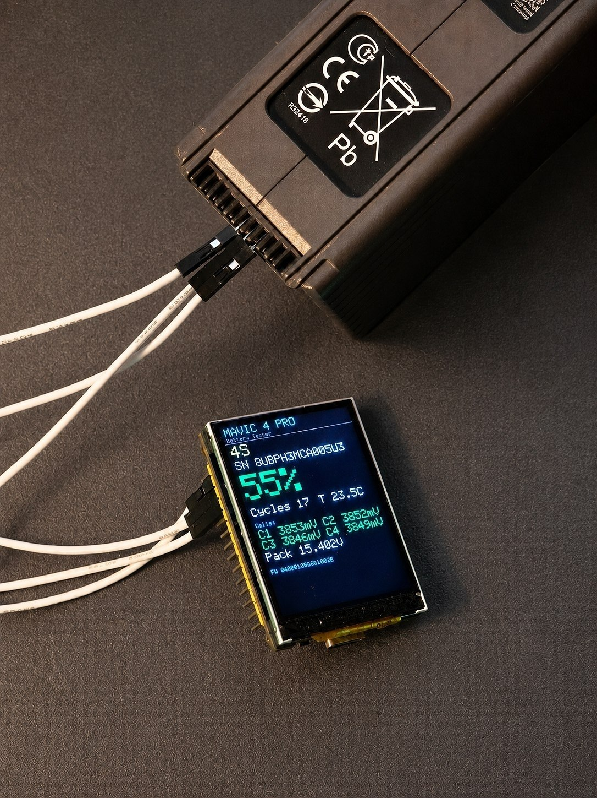
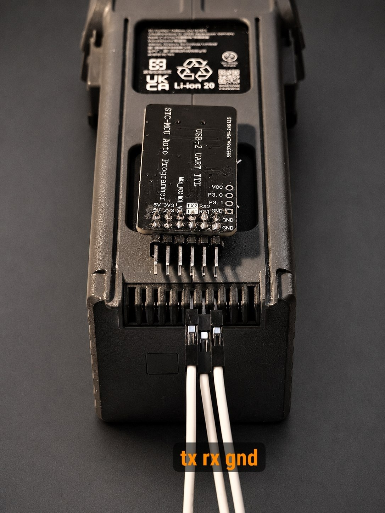

# DJI Battery Tester — ESP32-S3-Touch-LCD-2

Автономный тестер умных батарей DJI (Mavic 4 / WA341 и совместимых) по UART/DUML.
Читает батарею и выводит дашборд на встроенный экран 240×320.

Протокол, CRC и офсеты полей портированы из `../bat_serial.py` / `../PROTOCOL.md`
(сверено байт-в-байт с реальным хабом и живой батареей).

| Тестер на батарее Mavic 4 Pro | Врезка UART в контакты (TX / RX / GND) |
|:--:|:--:|
|  |  |

## Что показывает
Заголовок «MAVIC 4 PRO», **SoC %** (крупно, цвет по уровню), **S/N**, число банок (4S),
**циклы заряда**, температуру, **напряжения 4 банок (мВ)**, напряжение пакета, версию прошивки,
и снизу тонкую полоску заряда **встроенного LiPo контроллера**. То же дублируется в USB-Serial (115200).

## Подключение батареи
Гейдж батареи запитан всегда — **включать кнопкой НЕ нужно**. 3.3 В, сдвигатель не требуется.

| плата (силк) | GPIO | → батарея |
|---|---|---|
| **TX** | 43 | → вход RX батареи (линия idle-LOW) |
| **RX** | 44 | ← выход TX батареи (линия idle-HIGH) |
| **GND** | GND | ← общая земля (обязательно) |

Прошивка/питание/лог — по **USB-C** (нативный USB-CDC), поэтому пины UART0 (43/44) свободны под батарею.

## Сборка и заливка
```bash
cd esp32_tester
pio run                # собрать
pio run -t upload      # залить (плата по USB-C)
pio device monitor     # лог (115200)
```
Платформа — pioarduino (Arduino-ESP32 core 3.3.8). Пины LCD/UART зашиты в `src/main.cpp`
по схеме платы (LCD ST7789T3: MOSI38/SCLK39/DC42/CS45/RST0/BL1).

## Питание, кнопка, энергосбережение
- **Кнопка питания** на `GPIO18` (RTC-пин): `GPIO18 → кнопка → GND` (внутр. подтяжка).
  Включено → удержание ≈1.2 с = **выкл** (deep sleep). Выключено → нажатие = **вкл** (пробуждение ext1).
- Экономия: опрос **1 Гц**, CPU **80 МГц**, idle-`delay`, подсветка off во сне.
- ⚠ Красный **POWER**-светодиод (LED2) висит на рельсе 3.3 В через R22 — это **не GPIO**, firmware его
  не гасит: во сне он горит (~0.5 мА). Для настоящего «выкл» выпаять LED2/R22 или поставить аппаратный
  load switch на линию батареи.
- Индикатор **встроенного LiPo** контроллера: `BAT_ADC` на `GPIO5`, делитель **÷3** (R19 200K/R20 100K).
  Статуса заряда на GPIO нет (STAT зарядника только на красном LED) — на экране уровень по напряжению.

## Статус
- [x] Чтение DUML, парсинг полей, дашборд — **проверено на живой батарее WA341**.
- [x] Кнопка питания + deep sleep + энергосбережение (1 Гц / 80 МГц).
- [x] Полоска заряда встроенного LiPo.
- [ ] Опционально: тач (CST816, I2C 48/47/46), порог-тест «годна/нет», WiFi-страница,
      экранный флаг заряда (пайка STAT→GPIO), аппаратный выключатель питания.
